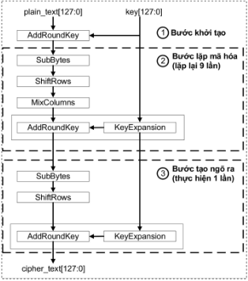
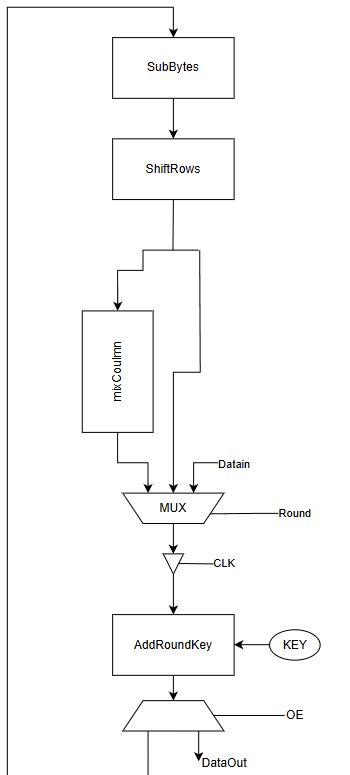
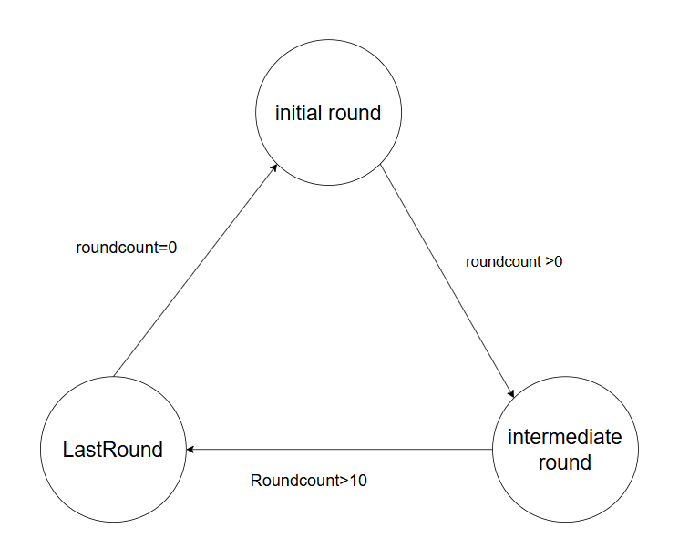
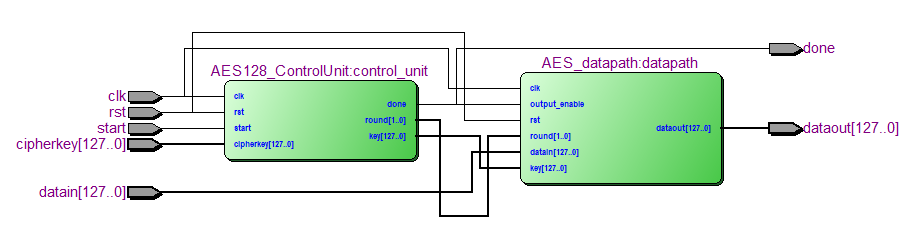
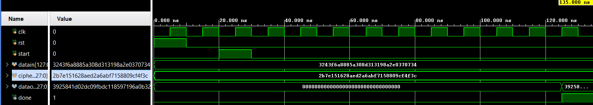
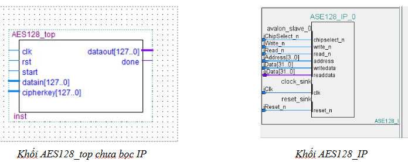
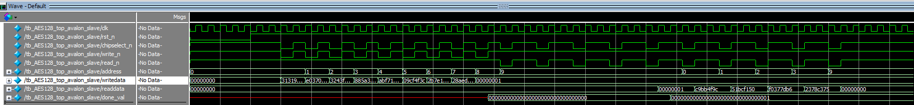

## Project Title: Implementation of an AES-128 Based SoC on FPGA with Pipelined Datapath and Affine-Optimized S-Box


## Project Description:
This project presents the design and implementation of a System-on-Chip (SoC) on FPGA for performing AES-128 encryption, with a strong focus on hardware optimization and resource efficiency. The system is deployed on the Altera DE2 FPGA development board.

To maximize performance and minimize resource usage, the datapath is designed with a custom internal pipelining structure, allowing concurrent execution of AES encryption rounds. In addition, the S-box module is implemented using an affine transformation-based algorithm, rather than a full lookup table (LUT), which significantly reduces logic utilization while maintaining correct functionality.

Key components include:

- A fully functional AES-128 encryption core.

- A pipelined datapath architecture to enable high-throughput processing.

- A resource-efficient S-box using affine transformations and multiplicative inversion in GF(2⁸).

- FSM-based controller for round management and key scheduling.

- Integration and synthesis on the DE2 FPGA board using Verilog HDL.

The system is intended for use in embedded cryptographic applications where security and hardware efficiency are equally critical.


##  Technology Stack:

(List the hardware platform, software tools, language(s), etc. you plan to use)
a. Hardware Technologies:
   . Kit Altera DE2-115 Development and Education Board
b. Programming Languages:
   . Verilog/System Verilog
   . C


# Introduction to AES-128 Encryption Algorithm

AES operates on a 4×4 matrix of bytes called the **state**. It performs **10 rounds** of transformation for AES-128, with each round including the following steps:

1. **SubBytes** – Byte-wise substitution using a non-linear S-box.
2. **ShiftRows** – Row-wise cyclic shifting of state bytes.
3. **MixColumns** – Column-wise mixing based on polynomial multiplication over GF(2⁸).
4. **AddRoundKey** – XOR operation with the round key derived from the main key.



# I. Verilog AES-128 TOP MODULE 

## 1. AES Datapath Module (`AES_datapath.v`)
   
This module implements the core datapath of the AES-128 encryption algorithm in hardware, using a pipelined design with round-level control. It integrates all main transformation stages and uses a multiplexer to control the flow between the initial, intermediate, and final rounds.



### Features
- 128-bit AES encryption datapath
- Supports 3 processing stages: initial, intermediate, and final round
- Includes all AES stages: SubBytes, ShiftRows, MixColumns, AddRoundKey
- Mux-controlled pipeline to switch input source per round
- Designed for integration into an AES SoC or FSM-based controller
- Written in synthesizable Verilog

####  I/O Ports

| Port           | Dir    | Width     | Description                                                 |
|----------------|--------|-----------|-------------------------------------------------------------|
| `clk`          | Input  | 1 bit     | Clock signal                                                |
| `rst`          | Input  | 1 bit     | Asynchronous reset                                          |
| `round`        | Input  | 2 bits    | AES round type: 00 = init, 01 = intermediate, 10 = final    |
| `datain`       | Input  | 128 bits  | Plaintext or previous round output                          |
| `key`          | Input  | 128 bits  | Round key input                                             |
| `output_enable`| Input  | 1 bit     | Enables output assignment                                   |
| `dataout`      | Output | 128 bits  | Final ciphertext (or test value if hardcoded)               |


### Internal Pipeline

The module contains:

1. **AddRoundKey**: XOR between state and key  
2. **SubBytes**: Byte substitution using S-box (affine transformation)  
3. **ShiftRows**: Cyclic row shifting  
4. **MixColumns**: Column mixing using GF(2^8)  
5. **MUX**: Selects stage input (Initial, MixColumns, or Final)

### Example Integration
This datapath is intended to be controlled by an FSM that:

- Feeds appropriate keys per round

- Updates the round input per clock cycle

- Monitors and enables output via output_enable


##  AES Control Unit (Finite State Machine)

This **Control Unit** manages the AES-128 encryption sequence by coordinating datapath operations over 10 rounds, with clearly defined stages:

---

### FSM States

| State Name     | Value   | Description                                                                 |
|----------------|---------|-----------------------------------------------------------------------------|
| `INITIAL`      | `2'b00` | First AddRoundKey: XOR plaintext with the original AES key                  |
| `INTERMEDIATE` | `2'b01` | Rounds 1 to 9: full AES operations (SubBytes → ShiftRows → MixColumns → AddRoundKey) |
| `LAST`         | `2'b10` | Final round (round 10): no MixColumns, only SubBytes → ShiftRows → AddRoundKey |

---

###  State Transition Logic

The FSM cycles through 10 AES rounds, managing which transformation to apply depending on the round number.

```verilog
reg [3:0] round_counter;
reg [1:0] round_state;

always @(posedge clk or posedge rst) begin
    if (rst) begin
        round_counter <= 0;
        round_state   <= INITIAL;
    end else begin
        case (round_counter)
            4'd0:  round_state <= INITIAL;
            4'd1, 4'd2, 4'd3, 4'd4,
            4'd5, 4'd6, 4'd7, 4'd8, 4'd9:
                  round_state <= INTERMEDIATE;
            4'd10: round_state <= LAST;
            default: round_state <= LAST;
        endcase
        round_counter <= round_counter + 1;
    end
end
```

## AES128-TOP MODULE 

### SIMULATION 

##  AES128 Avalon-MM Slave Interface 

###  I/O Port Table

| Signal Name     | Direction | Width  | Description                                                                 |
|------------------|-----------|--------|-----------------------------------------------------------------------------|
| `iClk`           | Input     | 1      | System clock                                                                |
| `iReset_n`       | Input     | 1      | Active-low synchronous reset                                                |
| `iChipSelect_n`  | Input     | 1      | Active-low chip select (enables access)                                     |
| `iWrite_n`       | Input     | 1      | Active-low write enable                                                     |
| `iRead_n`        | Input     | 1      | Active-low read enable                                                      |
| `iAddress`       | Input     | 4      | Address for selecting internal registers (0–9)                              |
| `iData`          | Input     | 32     | Write data bus (plaintext, key, start)                                      |
| `oData`          | Output    | 32     | Read data bus (ciphertext, done flag)                                       |

---

### Address Map

This module uses 32-bit addressable registers with the following mapping:

#### Write Operations

| Address | Purpose              | Description                                |
|---------|----------------------|--------------------------------------------|
| `0`     | Plaintext [31:0]     | Least significant 32 bits of plaintext      |
| `1`     | Plaintext [63:32]    | Next 32 bits                                |
| `2`     | Plaintext [95:64]    | Next 32 bits                                |
| `3`     | Plaintext [127:96]   | Most significant 32 bits                    |
| `4`     | Key [31:0]           | Least significant 32 bits of cipher key     |
| `5`     | Key [63:32]          | Next 32 bits                                |
| `6`     | Key [95:64]          | Next 32 bits                                |
| `7`     | Key [127:96]         | Most significant 32 bits                    |
| `8`     | Control              | Bit `0`: Write `1` to trigger encryption    |

#### Read Operations

| Address | Purpose               | Description                                |
|---------|-----------------------|--------------------------------------------|
| `0`     | Ciphertext [31:0]     | Least significant 32 bits of ciphertext     |
| `1`     | Ciphertext [63:32]    | Next 32 bits                                |
| `2`     | Ciphertext [95:64]    | Next 32 bits                                |
| `3`     | Ciphertext [127:96]   | Most significant 32 bits                    |
| `9`     | Status                | Bit `0`: `1` = Done, encryption complete    |

---

###  Operation Flow

1. **Reset** the module using `iReset_n`.
2. **Write plaintext** to addresses `0–3`.
3. **Write cipher key** to addresses `4–7`.
4. **Start encryption** by writing `1` to address `8` (`iData[0] = 1`).
5. **Poll address `9`** until `oData[0] = 1`, indicating encryption is done.
6. **Read ciphertext** from addresses `0–3`.

The `done` flag is cleared automatically after it is read once.



## AES128 Hardware Encryption on DE2 Kit

### System Components (Used IP Cores)

| IP Name             | Function                                |
|---------------------|------------------------------------------|
| `clk`               | System clock source                      |
| `reset`             | System reset signal                      |
| `nios2_gen2_0`      | Nios II processor core                   |
| `onchip_memory2_0`  | On-chip RAM (stores program code)        |
| `jtag_uart_0`       | UART over JTAG (used for terminal output)|
| `AES128_IP_0`       | Custom AES128 encryption IP              |

---

## Nios II Software Workflow (`source.c`)

This program controls hardware-based AES128 encryption through the custom IP core:

1. **Write input data** (plaintext) to the AES IP  
2. **Write encryption key** (AES key) to the AES IP  
3. **Send START signal** to initiate encryption  
4. **Wait until encryption is complete**  
5. **Read the output** (ciphertext)  
6. **Print the result** to terminal via `jtag_uart_0`

> **Goal**: Offload AES128 encryption to hardware for faster performance compared to software processing.
---

## Hardware Resource & Performance Report

### Hardware Resource Utilization

| Resource               | Used     | Available | Utilization (%) |
|------------------------|----------|-----------|------------------|
| Logic Elements / LUTs  | 5,200    | 33,216    | 15.65%           |
| Flip-Flops / Registers | 1,486    | —         | —                |
| Block RAM (bits)       | 273,408  | 483,840   | 56.5%            |
| DSP Blocks / Multipliers| 0       | 70        | 0%               |
| I/O Pins               | 2        | 475       | <1%              |
| PLLs                   | 0        | 4         | 0%               |


### Power & Performance Summary

| Metric                  | Value         |
|-------------------------|---------------|
| Total Power             | 111.94 mW     |
| Core Dynamic Power      | 0.98 mW       |
| Core Static Power       | 79.93 mW      |
| I/O Power               | 31.02 mW      |
| Max Clock Frequency     | 74.85 MHz     |
| AES Latency             | 56 cycles     |
| AES Throughput          | 171.09 Mbps   |

---

### Timing Performance

| Parameter                   | Value        |
|-----------------------------|--------------|
| **Maximum Clock Frequency** | **74.85 MHz** |
| Clock Domain                | `clk`        |
| Clock Period                | 13.36 ns     |
| FPGA Device                 | Cyclone II EP2C35F672C6 |

---


